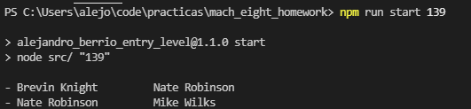
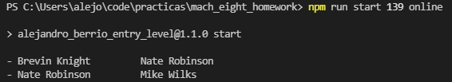
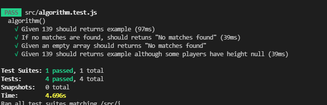

# Match eight entry level by Alejandro Berrio

## Scope
The purpose of this repository is to provide a solution to the match eight company's entry test, which requests to develop an algorithm to find pairs of NBA players that, when added, equals the entered value. 

## How to run
To run the application there are three ways to do it: local, online and unit tests.

But first it is essential after cloning it to install its node dependencies with 

``` npm install ```
### local
When running in local mode, what the application does is use a previously downloaded version of the data.

To do it simply run the following command

```npm run start [[value]]``` 

where `value` is the amount of the heights added

example:



### online

When running in online mode, what the application does is comsume and endpoint in order to get the data.

To do it simply run the following command

```npm run start [[value]] online``` 

where `value` is the amount of the heights added

example:



### tests

There are some unit tests that check the normal workflow of the algotihm
To do it simply run the following command

```npm run test``` 

example


